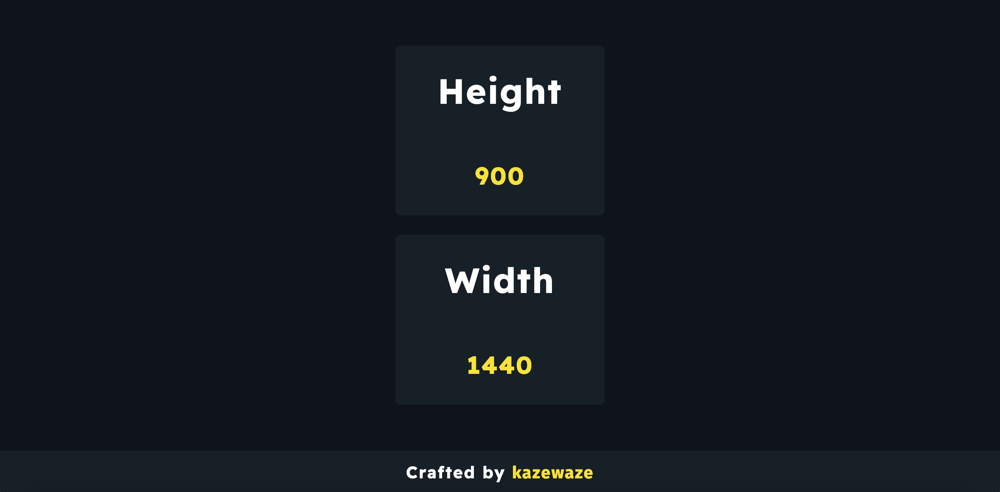

# SizeMeUp
---

### A Simple Website that displays your screen dimensions.

[Check It Out 👉🏻](https://sizemeup.netlify.app/)

  

### P.S. I borrowed some colors from [Josh Comeau](https://www.joshwcomeau.com) haha... 😅 If it's **No Bueno** then I'll gladly drop them! Enjoy!